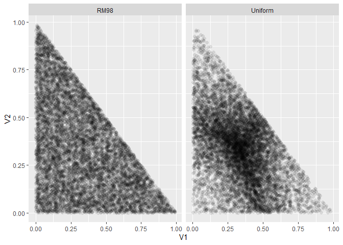

Generating Random Portolios
================

``` r
library(tidyverse)

source("utils.R")
```

One of the common problem in simulations is to generate random values
that uniformly cover the search space. This does not mean, however, that
the solution is to simply draw from the uniform distribution.

In the `utils.R` file, I introduced a
`generate_random_portfolio_weights()` function, which uses an approach
suggested in a [StackExchange
post](https://quant.stackexchange.com/a/49116), which in turn refers to
an approach by [Rubinstein and Melamed
(1998)](https://ie.technion.ac.il/~onn/Selected/AOR09.pdf). Values are
effectively drawn from the exponential distribution and then normalized
to the range between zero and one.

Let’s see how this approach performs. I draw 10000 portfolios, which
*seems* sufficient enough. Each portfolio consists of three elements
(there are three weights drawn), for the simplicity

``` r
n_portfolios <- 10000
n_weights <- 3
```

I generate the portfolios using the Rubinstein and Melamed approach
(RM98 for short).

``` r
random_portfolios_rm98 <- n_portfolios %>%
    replicate(generate_random_portfolio_weights(n_weights)) %>%
    t() %>%
    as_tibble() %>% 
    mutate(approach = "RM98")
```

    ## Warning: The `x` argument of `as_tibble.matrix()` must have unique column names if `.name_repair` is omitted as of tibble 2.0.0.
    ## Using compatibility `.name_repair`.
    ## This warning is displayed once every 8 hours.
    ## Call `lifecycle::last_warnings()` to see where this warning was generated.

As a benchmark I compare this with simply drawing three values from the
uniform distribution, and scaling them to between zero and one.

``` r
random_portfolios_unif <- n_portfolios %>%
    replicate(runif(n_weights)) %>%
    apply(2, function(row) row / sum(row)) %>% 
    t() %>%
    as_tibble() %>% 
    mutate(approach = "Uniform")
```

A purely visual comparison reveals that the RM98 approach *looks*
uniformly spread, as opposed to the benchmark approach.

``` r
random_portfolios <- rbind(random_portfolios_rm98, random_portfolios_unif)

random_portfolios %>%
    ggplot(aes(x = V1, y = V2)) +
    geom_point(alpha = 0.1, shape = 16, size = 2) +
    facet_grid(. ~ approach)
```

<!-- -->

Of course, to mathematically prove that the RM98 is indeed what we want
is a completely different story. This, however, is beyond the scope of
this repository, at least for now.
