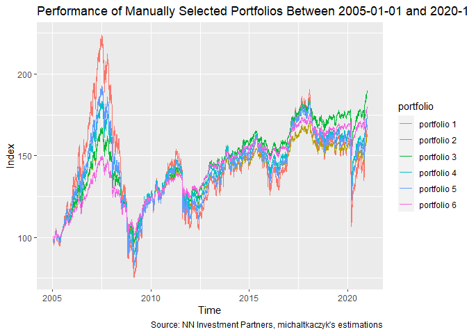

Portfolio Optimisation for NN Investment Parners
================

``` r
library(tidyverse)
library(tidyquant)
library(timetk)
library(lubridate)

source("utils.R")
```

``` r
HISTORICAL_DATA_PATH <- "./historical-fund-data"
METADATA_PATH <- "./fund-metadata.csv"
```

``` r
START_DAY <- ymd("2005-01-01")
END_DAY <- ymd("2020-12-31")
```

``` r
funds_metadata <- METADATA_PATH %>% 
    read_csv()

funds_data <- HISTORICAL_DATA_PATH %>% 
    list_nn_funds() %>% 
    bind_rows() %>% 
    left_join(funds_metadata) %>% 
    select(-fund) %>% 
    rename(fund = fund_short_name)

funds_old_enough <- funds_data %>%
    group_by(fund) %>%
    summarise(start_day = min(date)) %>% 
    filter(start_day <= START_DAY) %>% 
    pull(fund)

funds_data <- funds_data %>%
    filter(fund %in% funds_old_enough & date >= START_DAY & date <= END_DAY)
```

``` r
ggplot(funds_data, aes(x = date, y = value, color = fund)) +
    geom_line() +
    labs(
        title = paste("NN Funds Indices Between", START_DAY, "and", END_DAY),
        caption = "Source: NN Investment Partners, michaltkaczyk's estimations") +
    xlab("Time") +
    ylab("Index")
```

<!-- -->

``` r
funds_data_xts <- funds_data %>%
    select(-value) %>% 
    pivot_wider(names_from = fund, values_from = value_pct_change) %>% 
    tk_xts()

manual_portfolios <- rbind(
    c(1, 0, 0, 0, 0),
    c(1, 1, 0, 0, 0),
    c(1, 0, 1, 0, 0),
    c(1, 0, 0, 1, 0),
    c(1, 0, 0, 0, 1),
    c(1, 1, 1, 1, 1)) %>% 
    apply(1, function(x) x / sum(x)) %>% 
    t()

manual_portfolios_results <- list()

for (portfolio in 1:NROW(manual_portfolios)) {
    manual_portfolios_results[[portfolio]] <- 
        Return.portfolio(funds_data_xts, manual_portfolios[portfolio, ]) %>%
        as_tibble() %>% 
        add_column(date = index(funds_data_xts)) %>% 
        mutate(portfolio = paste("portfolio", portfolio)) %>% 
        rename(value = portfolio.returns)
}

portfolio_comparison <- manual_portfolios_results %>%
    bind_rows() %>% 
    group_by(portfolio) %>% 
    mutate(value = cumprod(value + 1) * 100)
```

``` r
ggplot(portfolio_comparison, aes(x = date, y = value, color = portfolio)) +
    geom_line() +
    labs(
        title = paste("Performance of Manually Selected Portfolios Between", START_DAY, "and", END_DAY),
        caption = "Source: NN Investment Partners, michaltkaczyk's estimations") +
    xlab("Time") +
    ylab("Index")
```

<!-- -->
