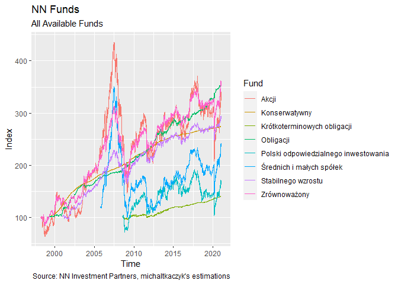
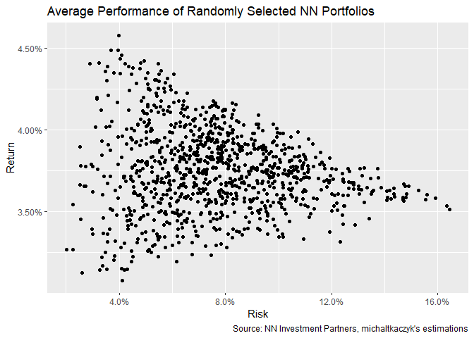
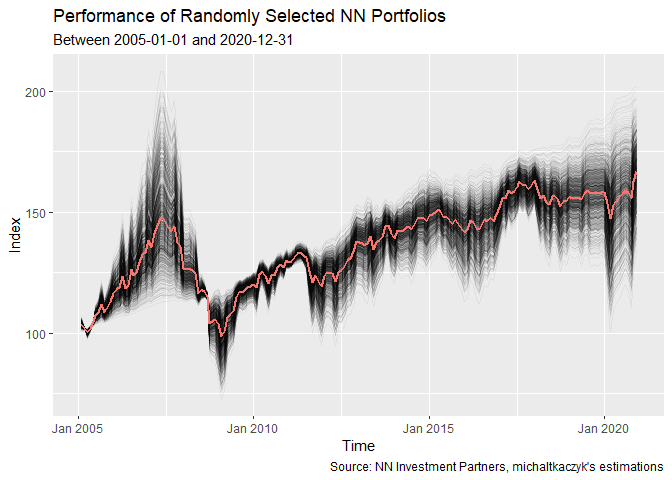
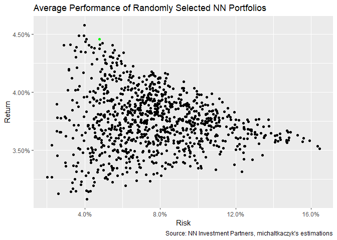

Portfolio Optimisation for NN Investment Parners
================

``` r
library(tidyverse)
library(tidyquant)
library(timetk)
library(lubridate)

source("utils.R")
```

``` r
HISTORICAL_DATA_PATH <- "./historical-fund-data"
METADATA_PATH <- "./fund-metadata.csv"
```

``` r
START_DAY <- ymd("2005-01-01")
END_DAY <- ymd("2020-12-31")
```

``` r
funds_metadata <- METADATA_PATH %>% 
    read_csv()

funds_data <- HISTORICAL_DATA_PATH %>% 
    list_nn_funds() %>% 
    bind_rows() %>% 
    left_join(funds_metadata) %>% 
    select(date, fund = fund_short_name, value)
```

These are all the funds used in the analysis.

``` r
ggplot(funds_data, aes(x = date, y = value, color = fund)) +
    geom_line() +
    labs(
        title = "NN Funds",
        subtitle = "All Available Funds",
        caption = "Source: NN Investment Partners, michaltkaczyk's estimations",
        color = "Fund") +
    xlab("Time") +
    ylab("Index")
```

<!-- -->

Let’s do some data processing here.

First of all, let’s drop all founds that are not fully contained within
a specified time period.

``` r
funds_old_enough <- funds_data %>%
    group_by(fund) %>%
    summarise(start_day = min(date)) %>%
    filter(start_day <= START_DAY) %>% 
    pull(fund)

funds_data <- funds_data %>%
    filter(fund %in% funds_old_enough & date >= START_DAY & date <= END_DAY)
```

Now, let’s change the format to `xts`, for convenience of calculations
later on. In the meantime, I am replacing all `NA` values with zeros, so
that they are not dropped in the next step.

``` r
funds_data <- funds_data %>%
    pivot_wider(names_from = fund, values_from = value) %>% 
    tk_xts(select = -date, date_var = date)
```

The next step is to change the granularity from daily to monthly. This
should be enough for my purposes.

``` r
funds_data <- funds_data %>% 
    to.monthly(indexAt = "yearmon", OHLC = FALSE)
```

Finally let’s change the absolute values to monthly rates of change.

``` r
funds_data <- funds_data %>% 
    ROC(na.pad = FALSE)
```

Let’s see where we got after all of those manipulations.

``` r
funds_data_long <- funds_data %>%
    tk_tbl(rename_index = "date") %>% 
    pivot_longer(!date, "fund") %>%
    group_by(fund) %>% 
    arrange(date) %>% 
    mutate(value = cumprod(value + 1)) %>% 
    ungroup()

ggplot(funds_data_long, aes(x = date, y = value, color = fund)) +
    geom_line() +
    labs(
        title = "NN Funds",
        subtitle = "All Available Funds",
        caption = "Source: NN Investment Partners, michaltkaczyk's estimations",
        color = "Fund") +
    xlab("Time") +
    ylab("Index")
```

<!-- --> Let’s try
randomly generating the portfolios.

``` r
N_PORTFOLIOS <- 1000

random_portfolios_weights <-
    N_PORTFOLIOS %>%
    replicate(generate_random_portfolio_weights(NCOL(funds_data))) %>% 
    t()

colnames(random_portfolios_weights) <- colnames(funds_data)

random_portfolios_results_list <- list()

for (portfolio in 1:N_PORTFOLIOS) {
    random_portfolios_results_list[[portfolio]] <- 
        Return.portfolio(funds_data, random_portfolios_weights[portfolio, ]) %>%
        tk_tbl(rename_index = "date") %>% 
        mutate(
            value = cumprod(portfolio.returns + 1) * 100,
            portfolio = paste("portfolio", portfolio)) %>% 
        select(-portfolio.returns)
}

random_portfolios_results <- random_portfolios_results_list %>%
    bind_rows()
```

``` r
p1 <- ggplot(random_portfolios_results) +
    geom_line(aes(x = date, y = value, group = portfolio), alpha = 0.05) +
    labs(
        title = "Performance of Randomly Selected NN Portfolios",
        subtitle = paste("Between", START_DAY, "and", END_DAY),
        caption = "Source: NN Investment Partners, michaltkaczyk's estimations",
        color = "Portfolio") +
    stat_summary(aes(x = date, y = value), fun = mean, geom = "line", color = "#F8766D", size = 1) +
    xlab("Time") +
    ylab("Index")

p1
```

<!-- -->

``` r
funds_expected_returns_vector <- (1 + apply(funds_data, 2, mean, na.rm = TRUE)) ^ 12 - 1
funds_covariance_matrix <- cov(funds_data, use = "na.or.complete") * 12

random_portfolios_averages <- random_portfolios_weights %>% 
    as_tibble() %>% 
    add_column(risk = 0, return = 0)

for (portfolio in 1:N_PORTFOLIOS) {
    funds_weights <- random_portfolios_weights[portfolio, ]
    
    random_portfolios_averages[portfolio, "return"] <-
        sum(funds_expected_returns_vector * funds_weights)
    
    random_portfolios_averages[portfolio, "risk"] <-
        as.numeric(sqrt(funds_weights %*% funds_covariance_matrix %*% funds_weights))
}

p2 <- ggplot(random_portfolios_averages, aes(x = risk, y = return)) +
    geom_point() +
    labs(
        title = "Average Performance of Randomly Selected NN Portfolios",
        caption = "Source: NN Investment Partners, michaltkaczyk's estimations") +
    xlab("Risk") +
    ylab("Return") +
    scale_x_continuous(labels = scales::percent) +
    scale_y_continuous(labels = scales::percent)

p2
```

<!-- -->

Let’s try this portfolio:

``` r
selected_portfolio_weights <- c(.1, 0, .7, .1, .1)

selected_portfolio_results <- Return.portfolio(funds_data, selected_portfolio_weights) %>% 
    tk_tbl(rename_index = "date") %>% 
    mutate(
        value = cumprod(portfolio.returns + 1) * 100,
        portfolio = "selected") %>% 
    select(-portfolio.returns)

selected_portfolio_return <- sum(funds_expected_returns_vector * selected_portfolio_weights)
selected_portfolio_risk <- as.numeric(sqrt(selected_portfolio_weights %*% funds_covariance_matrix %*% selected_portfolio_weights))

p1 + stat_summary(data = selected_portfolio_results, aes(x = date, y = value), fun = mean, geom = "line", color = "green", size = 1)
```

<!-- -->

``` r
p2 + geom_point(aes(y = selected_portfolio_return, x = selected_portfolio_risk), colour = "green")
```

<!-- -->
