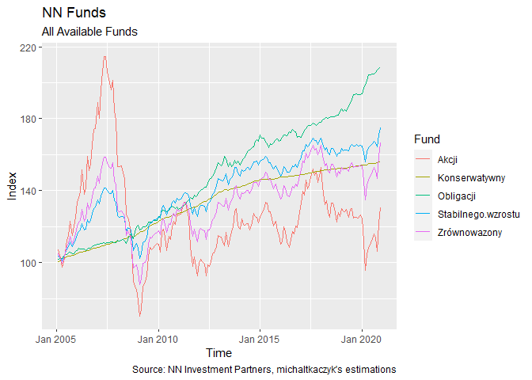

Portfolio Optimisation for NN Investment Parners
================

``` r
library(tidyverse)
library(tidyquant)
library(timetk)
library(lubridate)

source("utils.R")
```

``` r
HISTORICAL_DATA_PATH <- "./historical-fund-data"
METADATA_PATH <- "./fund-metadata.csv"
```

``` r
START_DAY <- ymd("2005-01-01")
END_DAY <- ymd("2020-12-31")
```

``` r
funds_metadata <- METADATA_PATH %>% 
    read_csv()

funds_data <- HISTORICAL_DATA_PATH %>% 
    list_nn_funds() %>% 
    bind_rows() %>% 
    left_join(funds_metadata) %>% 
    select(-fund) %>% 
    rename(fund = fund_short_name)
```

These are all the funds used in the analysis.

``` r
ggplot(funds_data, aes(x = date, y = value, color = fund)) +
    geom_line() +
    labs(
        title = "NN Funds - All Available Funds",
        caption = "Source: NN Investment Partners, michaltkaczyk's estimations") +
    xlab("Time") +
    ylab("Index")
```

<!-- -->

Let’s do some data processing here.

First of all, let’s drop all founds that are not fully contained within
a specified time period.

``` r
funds_old_enough <- funds_data %>%
    group_by(fund) %>%
    summarise(start_day = min(date)) %>%
    filter(start_day <= START_DAY) %>% 
    pull(fund)
```

    ## `summarise()` ungrouping output (override with `.groups` argument)

``` r
funds_data <- funds_data %>%
    filter(fund %in% funds_old_enough & date >= START_DAY & date <= END_DAY)
```

Now, let’s change the format to `xts`, for convenience of calculations
later on. In the meantime, I am replacing all `NA` values with zeros, so
that they are not dropped in the next step.

``` r
funds_data <- funds_data %>%
    pivot_wider(names_from = fund, values_from = value) %>% 
    tk_xts()
```

    ## Warning: Non-numeric columns being dropped: date

    ## Using column `date` for date_var.

The next step is to change the granularity from daily to monthly. This
should be enough for my purposes.

``` r
funds_data <- funds_data %>% 
    to.monthly(indexAt = "yearmon", OHLC = FALSE)
```

Finally let’s change the absolute values to monthly rates of change.

``` r
funds_data <- funds_data %>% 
    ROC()
```

Let’s see where we got after all of those manipulations.

``` r
funds_data_dates <- funds_data %>% 
    index() %>% 
    as_tibble() %>% 
    rename(date = value)

funds_data_long <- funds_data %>%
    as_tibble() %>%
    add_column(funds_data_dates) %>% 
    pivot_longer(!date, "fund") %>%
    replace_na(list(value = 0)) %>% 
    group_by(fund) %>% 
    arrange(date) %>% 
    mutate(value = cumprod(value + 1)) %>% 
    ungroup()

ggplot(funds_data_long, aes(x = date, y = value, color = fund)) +
    geom_line() +
    labs(
        title = "NN Funds - All Available Funds",
        caption = "Source: NN Investment Partners, michaltkaczyk's estimations") +
    xlab("Time") +
    ylab("Index")
```

<!-- -->

Let’s check some manually created portfolios’ performance.

``` r
manual_portfolios <- rbind(
    c(1, 0, 0, 0, 0),
    c(1, 1, 0, 0, 0),
    c(1, 0, 1, 0, 0),
    c(1, 0, 0, 1, 0),
    c(1, 0, 0, 0, 1),
    c(1, 1, 1, 1, 1)) %>% 
    apply(1, function(x) x / sum(x)) %>% 
    t()

manual_portfolios_results <- list()

for (portfolio in 1:NROW(manual_portfolios)) {
    manual_portfolios_results[[portfolio]] <- 
        Return.portfolio(funds_data, manual_portfolios[portfolio, ]) %>%
        as_tibble() %>% 
        add_column(date = index(funds_data)) %>% 
        mutate(portfolio = paste("portfolio", portfolio)) %>% 
        rename(value = portfolio.returns)
}

portfolio_comparison <- manual_portfolios_results %>%
    bind_rows() %>% 
    group_by(portfolio) %>% 
    mutate(value = cumprod(value + 1) * 100)
```

``` r
ggplot(portfolio_comparison, aes(x = date, y = value, color = portfolio)) +
    geom_line() +
    labs(
        title = paste("Performance of Manually Selected Portfolios Between", START_DAY, "and", END_DAY),
        caption = "Source: NN Investment Partners, michaltkaczyk's estimations") +
    xlab("Time") +
    ylab("Index")
```

<!-- -->
